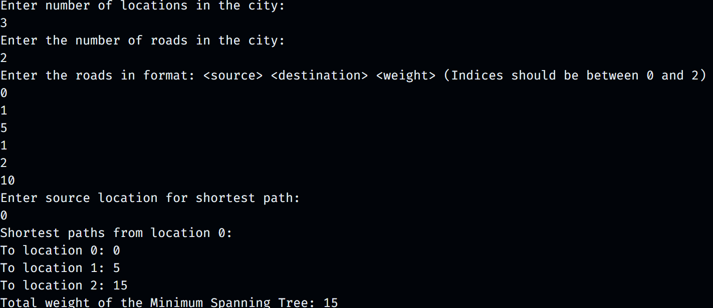

# Suvam's Smart City Traveller 🚗🌆

Smart City Traveller is a Java-based project that simulates navigation and optimization within a city's road network. The project utilizes core Data Structures and Algorithms (DSA) concepts like Graph representation, Dijkstra's shortest path algorithm, and Kruskal's Minimum Spanning Tree (MST) to provide efficient routing and road optimization. This project doesn't rely on any backend services or external libraries and focuses purely on algorithmic implementations.

# Screenshots

# Features 📋

Graph Representation of a City: Locations and roads between them are represented as a weighted undirected graph.
Shortest Path Calculation: Uses Dijkstra's algorithm to find the shortest path between any two locations.
Minimum Spanning Tree Calculation: Uses Kruskal's algorithm to optimize the road network, ensuring the minimum cost to connect all locations.
Efficient Data Structures: Implements adjacency lists, priority queues, and disjoint sets for efficient graph operations.

# Algorithms Used 🚀

1. Dijkstra's Algorithm
   Why it is used: Dijkstra’s algorithm is used to compute the shortest paths between a source location and all other locations in the city. It ensures that each road's weight (distance or traffic) is minimized when calculating the optimal route.
   What it does: It maintains a priority queue (min-heap) to iteratively explore the nearest unvisited location, relaxing the edges as needed to find the shortest path to all other locations.
   Key Concept: Greedy approach to find the shortest path in a weighted graph with non-negative edge weights.

- Time Complexity: O((V + E) \* log(V)), where V is the number of vertices (locations) and E is the number of edges (roads).

2. Kruskal's Minimum Spanning Tree (MST) Algorithm
   Why it is used: Kruskal’s algorithm is used to compute the Minimum Spanning Tree (MST) of the city's road network, which optimizes the total cost to connect all locations while minimizing the total weight of the roads.
   What it does: It sorts all the roads (edges) by weight and uses a disjoint-set (union-find) data structure to add the smallest road to the MST, as long as it doesn’t form a cycle.
   Key Concept: Greedy approach to ensure that the total weight of roads is minimized while maintaining full connectivity between locations.

- Time Complexity: O(E \* log(V)), where V is the number of vertices (locations) and E is the number of edges (roads).

# Project Structure 📂

The project is divided into several Java classes, each focusing on a specific part of the system. Below is the structure and description of the files:
SmartCityTraveller/
│
├── src/
│ ├── City.java # Defines the city's graph structure (locations and roads)
│ ├── Dijkstra.java # Implements Dijkstra's algorithm for shortest path
│ ├── MinimumSpanningTree.java # Implements Kruskal's algorithm for Minimum Spanning Tree
│ ├── SmartCityTraveller.java # Main class handling user interaction and execution
│
├── README.md # Detailed description of the project and its features

# File Descriptions:

City.java

Contains the graph representation of the city, where locations are nodes and roads are edges.
Provides methods to add locations and roads, and returns adjacency lists for graph traversal.
Dijkstra.java

Implements Dijkstra's algorithm to calculate the shortest path from a given source location to all other locations.
Uses a priority queue to efficiently calculate minimum distances.
MinimumSpanningTree.java

Implements Kruskal’s algorithm for finding the Minimum Spanning Tree (MST) of the city's road network.
Utilizes a disjoint-set (union-find) to efficiently manage connected components and avoid cycles.
SmartCityTraveller.java

The main class of the project, which interacts with the user by allowing them to enter city locations, roads, and run shortest path and MST queries.

# Example Input:

Enter number of locations in the city:
4
Enter the number of roads in the city:
5
Enter the roads in format: <source> <destination> <weight>
0 1 10
0 2 6
0 3 5
1 3 15
2 3 4
Enter source location for shortest path:
0

# Output of Example Input:

Enter number of locations in the city:
4
Enter the number of roads in the city:
5
Enter the roads in format: <source> <destination> <weight>
0 1 10
0 2 6
0 3 5
1 3 15
2 3 4
Enter source location for shortest path:
0
Shortest paths from location 0:
To location 0: 0
To location 1: 10
To location 2: 6
To location 3: 5
Total weight of the Minimum Spanning Tree: 19

# Acknowledgments

Developed as a learning project to explore data structures and algorithms in Java.
Thanks to the Java community for the resources that made this project possible.

# License

This project is licensed under the [MIT License](https://docs.github.com/en/repositories/managing-your-repositorys-settings-and-features/customizing-your-repository/licensing-a-repository) . See the LICENSE file for more details.

# Suvam Mohapatra
